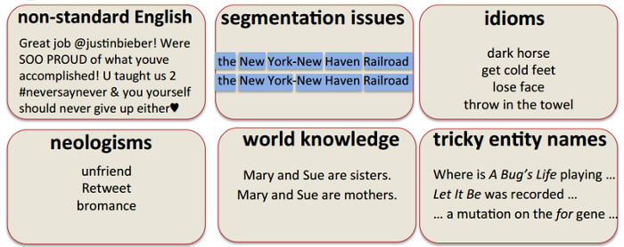

# ¿Qué es el PLN?

El Procesamiento del Lenguaje Natural (PLN)\footnote{En inglés, \textit{Natural Language Processing} (NLP) o mejor \#NLProc.} es el estudio científico del lenguaje desde un punto de vista computacional.

Es un área claramente multidisciplinar: lingüística, ingeniería, inteligencia artificial, informática, psicología, etc.

El PLN se interesa en proporcionar modelos computacionales para describir, modelar o reproducir distintos fenómenos lingüísticos. Tradicionalmente, estos modelos han tenido dos aproximaciones diferentes:

1. sistemas basados en conocimiento: en problemas que podemos modelar, proporcionamos conocimiento lingüístico formalizado.

2. sistemas basados en estadística: en problemas que no podemos modelar, proporcionamos ingentes cantidades de datos (colecciones de documentos) y dejamos que la máquina cree el modelo a partir del cálculo de probabilidades y la detección de patrones de uso.

## Tareas típicas del PLN

Una buena manera de conocer los temas que trata un área de investigación es revisar el programa de los congresos más importantes:\footnote{http://www.cs.rochester.edu/$\sim$tetreaul/conferences.html}
  
- ACL 2015: *call for papers*\footnote{http://acl2015.org/call\_for\_papers.html} y programa\footnote{http://acl2015.org/program.html}

- EMNLP 2015: *call for papers*\footnote{http://www.emnlp2015.org/call.html} y programa\footnote{http://www.emnlp2015.org/program.html}

- COLING 2014: *call for papers*\footnote{http://www.coling-2014.org/call-for-papers.php} y programa\footnote{http://www.coling-2014.org/schedule.php}

- SEPLN 2015: *call for papers*\footnote{http://gplsi.dlsi.ua.es/sepln15/es/2-convocatoria-de-comunicaciones} y programa\footnote{http://gplsi.dlsi.ua.es/sepln15/es/node/52}

De este modo, podemos identificar algunas de las tareas más comunes del área:

- Desambiguación semántica (*word sense disambiguation*) y reconocimiento de entidades (*named entities recognition*).

- Análisis morfo-sintáctico (*[PoS tagging](http://nbviewer.ipython.org/gist/vitojph/5465948)/[parsing](http://nbviewer.ipython.org/gist/vitojph/5524353)*)

- Traducción automática (*machine translation*): [Google Translate](http://translate.google.es)

- Extracción de información (*information extraction*): [TripIt](https://www.tripit.com/)

- Reconocimiento del habla (*automatic speech reconition*) y síntesis de voz (*speech synthesis*): [Google Voice Search](http://www.google.com/insidesearch/features/voicesearch/index-chrome.html)

- Recuperación de información (*information retrieval*): [Google Search](),
  [Bing](http://www.bing.com) y [Wolfram|Alpha](http://www.wolframalpha.com/)

- Resumen automático (*automatic summarization*) y generación automática de textos: [Quakebot](http://www.latimes.com/local/earthquakes/) y [Automated Insights](http://automatedinsights.com/)

- Búsqueda de respuestas (*question answering*): [Ask.com](http://www.ask.com),
  [Watson](http://www.youtube.com/watch?v=WFR3lOm_xhE)

- Análisis de opiniones (*sentiment analysis*) [NaturalOpinions](http://demos.bitext.com/naturalopinions/)

- Comprensión del lenguaje natural (*natural language understanding*): [Siri](http://www.apple.com/es/ios/siri/), [Ok Google](https://support.google.com/websearch/answer/2940021?hl=es) y [Cortana](http://windows.microsoft.com/es-es/windows-10/getstarted-what-is-cortana)

## Problemas resueltos y cuestiones abiertas

# ¿Por qué es tan difícil el PLN?

El lenguaje natural es eminentemente **ambiguo**:. Esta es la principal diferencia entre lenguas naturales y lenguajes artificiales.
  
Esta ambigüedad existe a varios niveles:

- ambigüedad fonética y fonológica: *vaca/baca*, *casa/caza*, *has sido tú/has ido tú*

- ambigüedad morfológica: *casa, beso, río, bajo*

- ambigüedad sintáctica: *Ayer me encontré a tu padre corriendo* 

- ambigüedad semántica: banco, pie, 

- ambigüedad de discurso: correferencia, resolución de anáforas

Según la ACL (*Association for Computational Linguistics*): *Computational Linguistics, or Natural Language Processing (NLP), is not a new field*.\footnote{http://www.aclweb.org/aclwiki/index.php
?title=Frequently\_asked\_questions
\_about\_Computational\_Linguistics}, sin embargo no es sencillo definir los límites de la disciplina. Así que podemos considerarla como un conjunto de problemas relacionados con fenómenos lingüísticos y una amalgama de soluciones computacionales, de distinto tipo dependiendo del origen del investigador. 

Según xkcd,\footnote{http://www.xkcd.org/114/} los lingüistas computacionales han vivido muy bien hasta ahora vendiendo motos, así que no se merecen más que nos metamos con ellos :-) \footnote{http://www.explainxkcd.com/wiki/index.php/
114:\_Computational\_Linguists}

