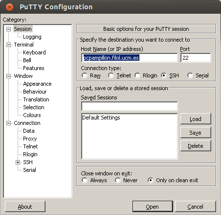
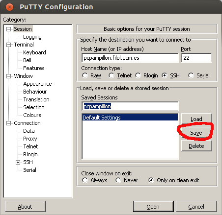
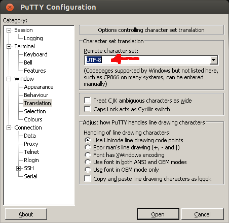
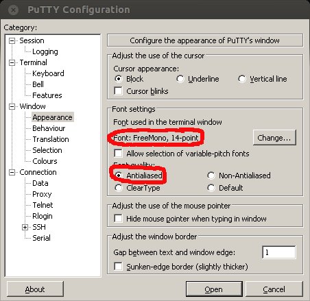
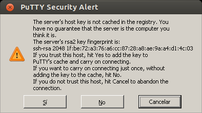
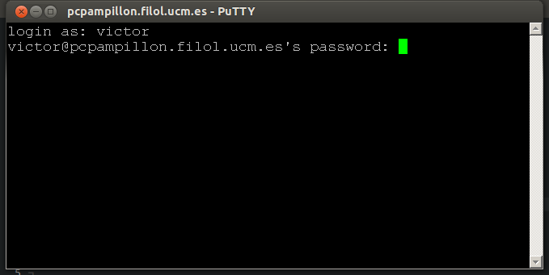
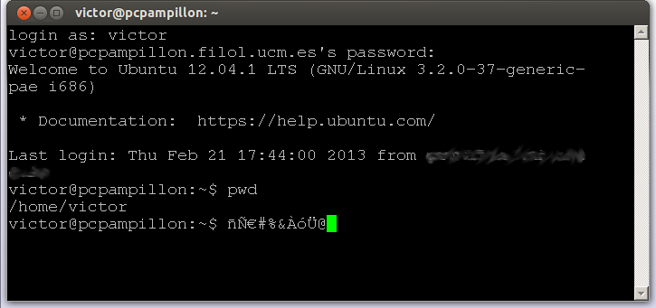

# SSH

SSH (*Secure Shell*) [^ssh] es un protocolo de internet que permite: 

- Acceder a máquinas remotas a través de una red y manejarlas como si estuviéramos sentados delante de ellas.
- Al contrario que protocolos más antiguos como Telnet, [^telnet] hacerlo de forma cifrada y completamente segura.

Para acceder a algunas de las herramientas que vamos a ver en la clase de **Programación para el Procesamiento del Lenguaje Natural** nos vamos a conectar a un servidor Linux de uso común. De este modo no tendremos que instalar herramientas en nuestro ordenador: solo necesitaremos un cliente SSH y una conexión a internet.

## PuTTY: un cliente SSH para Windows

Si trabajamos desde Windows, el cliente SSH más conocido que podemos utilizar se llama PuTTY. [^putty]

Es un programita sencillo que no requiere instalación. Simplemente:

1. Vamos a la página de descarga de PuTTY. [^putty-download] 
2. En el apartado *Binaries For Windows on Intel x86* descargamos el programa ``putty.exe``. [^putty-exe]
3. Es recomendable guardar este ejecutable en un sitio visible de nuestro ordenador: idealmente, en el ``Escritorio``, o mejor, dentro de ``Mis Documentos``.
4. Una vez en nuestro disco, lo ejecutamos con doble clic.

\marginnote{PuTTY es tan pequeño que, llegado el caso, se puede ejecutar directamente desde un pendrive.}

## Clientes SSH en Linux y OS X

Cualquier sistema operativo de tipo UNIX (como Linux y OS X) tienen clientes SSH desde el terminal. En principio, no hace falta instalar nada.

# Conectar a una máquina remota

Una vez estamos provistos de un cliente SSH, para conectarnos a un ordenador de forma remota necesitamos tres datos:

1. El nombre o la dirección IP del ordenador al que queremos conectarnos. En nuestro caso, el ordenador se llama ``139.162.146.12``.

2. Un nombre de usuario. Por defecto, tu nombre de usuario será la inicial de tu nombre de pila y tu apellido, en minúsculas y sin tildes. Si te llamas Pepito Pérez, tu usuario es ``pperez``. 

3. La contraseña que te da acceso y que solo tú conoces. Si nunca la has cambiado, por defecto será ``cambiala``. Pero hazme caso y cámbiala la primera vez que te conectes tecleando ``passwd``.

## Conexión con PuTTY

Para conectar, tecleamos el nombre del ordenador remoto en el recuadro *Host name* y pulsamos *Open*. \marginnote{En los pantallazos, aparece como nombre de servidor una máquina que ya no funciona. Por favor, olvídalo y utiliza siempre la IP de nuestro servidor: \texttt{139.162.146.12}.}

El resto de opciones las podemos dejar por defecto (*Port: 22* y *Connection type: SSH*).

## Guardar datos de conexiones

Para evitar tener que teclear el nombre del ordenador remoto cada vez que nos conectamos, podemos guardar los datos de la sesión.

Basta con teclear un nombre en el apartado *Saved Sessions* y pulsar en *Save*.

## Codificación y cambio de letra

Para asegurarnos de que PuTTY visualiza correctamente todos los caracteres,\marginnote{Windows y Linux suelen trabajar con codificaciones diferentes y a menudo las eñes y las tildes no funcionan correctamente} es imprescindible cambiar algunos parámetros de configuración de la conexión.

- En la Opción *Window* > *Translation*, abre el desplegable que cuelga del apartado *Remote character set* y elige la opción **UTF-8**.

- Si quieres cambiar el tipo de letra, puedes hacerlo desde el apartado *Window* > *Appearance* > *Font settings*.\marginnote{El tema estético es cuestión de gustos, pero es recomendable utilizar una fuente de ancho fijo (cualquier fuente de tipo \texttt{Monospaced}, \texttt{Fixed}, \texttt{Courier} o \texttt{Typewritter}) y la opción \textit{Antialiased}.} 

- Si quieres guardar esta configuración, asegúrate de que vuelves a la opción *Session*, seleccionas el nombre de la conexión que quieres y pulsas en *Save*.

La primera vez que nos conectemos, PuTTY nos preguntará si debe registrar la clave del ordenador al que nos estamos conectando. Podemos confiar en él sin problemas. Simplemente pulsamos *Sí* y seguimos adelante. 

Cuando abrimos una conexión con PuTTY, el ordenador remoto nos pedirá que nos identifiquemos con un nombre de usuario y una contraseña. Tecleamos nuestro nombre de usuario tras el ``login as`` y pulsamos intro.\marginnote{¡Ojo! al teclear la contraseña, por seguridad, ésta se mantiene oculta y no se nos muestra por pantalla.}

# ¡Ya estamos dentro!

Si nos identificamos correctamente, entramos en el sistema y recibimos un mensaje de bienvenida. 

Para estar seguros de que tenemos correctamente configurada la codificación, podemos teclear diacríticos y otros símbolos poco comunes para comprobar que todo se visualiza como toca.

[^ssh]: http://es.wikipedia.org/wiki/Secure_Shell
[^telnet]: http://es.wikipedia.org/wiki/Telnet
[^putty]: http://www.chiark.greenend.org.uk/~sgtatham/putty/
[^putty-download]: http://www.chiark.greenend.org.uk/~sgtatham/putty/download.html
[^putty-exe]: http://the.earth.li/~sgtatham/putty/latest/x86/putty.exe
